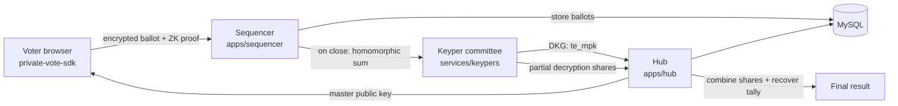

# Permanent private voting (`shutter-elgamal`)

This is the single entry point for Snapshot's **permanent private voting** feature. It adds a new
proposal privacy mode, `privacy: 'shutter-elgamal'`, in which every ballot is encrypted in the
browser and **stays encrypted forever** — only the final tally is ever revealed, and not even the
Snapshot backend can decrypt an individual vote.

It is built on **linearly-homomorphic threshold ElGamal over BLS12-381**: voters encrypt their
ballots under a committee master public key, the encrypted ballots are summed homomorphically, and a
committee of independent **keypers** jointly decrypt only the aggregate. With threshold `t = 1, n = 3`,
two honest keypers must cooperate to open a tally and no single keyper (nor the server) can learn
anything about how anyone voted.

## Contents

- [How it works](#how-it-works)
- [Where the code lives](#where-the-code-lives)
- [Crypto parameters](#crypto-parameters)
- [Running it — Docker (recommended)](#running-it--docker-recommended)
- [Running it — native dev](#running-it--native-dev)
- [End-to-end vote flow](#end-to-end-vote-flow)
- [Keyper service & auto-DKG](#keyper-service--auto-dkg)
- [Per-proposal configuration & lifecycle](#per-proposal-configuration--lifecycle)
- [Security model](#security-model)
- [Validation status](#validation-status)
- [Troubleshooting](#troubleshooting)

---

## How it works



1. **Key generation (DKG).** When a `shutter-elgamal` proposal is created, the keyper committee runs
   a Feldman-VSS distributed key generation and publishes a single master public key (`te_mpk`) to
   the hub. No party ever holds the full secret key.
2. **Voting.** The browser encrypts the ballot under `te_mpk` using the
   [`@snapshot-labs/private-vote-sdk`](../../packages/private-vote-sdk), attaches a zero-knowledge
   proof that the ballot is well-formed (per-candidate range + aggregate budget), and signs it with
   the voter's wallet (EIP-712). The sequencer verifies every ballot at ingest time.
3. **Tally.** After the proposal closes, the sequencer homomorphically sums the ciphertexts and the
   keypers each publish a partial decryption share (with a DLEQ proof). The hub combines `t+1` shares
   via Lagrange interpolation and recovers the plaintext totals (baby-step-giant-step). Individual
   ballots are never decrypted.

A voter with voting power `N` is counted `N` times by scaling their ciphertexts by `w = round(vp)`
before the homomorphic sum — **no change to the ballot cryptography**.

---

## Where the code lives

| Component         | Path                                                                     | Role                                                                                                      |
| ----------------- | ------------------------------------------------------------------------ | --------------------------------------------------------------------------------------------------------- |
| Client crypto SDK | [packages/private-vote-sdk](../../packages/private-vote-sdk)             | Ballot construction, ZK proofs, ballot/share verification, tally recovery. TS, BLST WASM.                 |
| Hub               | [apps/hub](../../apps/hub)                                               | GraphQL/REST API. Stores proposals, DKG submissions, decryption shares; finalizes `te_mpk` and the tally. |
| Sequencer         | [apps/sequencer](../../apps/sequencer)                                   | Authenticated vote ingestion; verifies each ballot; runs the tally worker on close.                       |
| Keyper committee  | [services/keypers](../../services/keypers)                               | Python service. Runs DKG and partial decryption. Includes the auto-DKG coordinator.                       |
| Voter UI          | [apps/ui](../../apps/ui)                                                 | Builds encrypted ballots locally with the SDK; surfaces the privacy selector.                             |
| Docker stack      | [docker-compose.yml](../../docker-compose.yml) · [docker/](../../docker) | One-command backend (MySQL + hub + sequencer + 3 keypers + auto-DKG).                                     |

---

## Crypto parameters

| Parameter      | Value                                                                   |
| -------------- | ----------------------------------------------------------------------- |
| Curve          | BLS12-381 (ElGamal in G₂, Schnorr in G₁)                                |
| Threshold      | `t = 1, n = 3` (two honest keypers required to open a tally)            |
| Ballot variant | Variant A, exact budget `B = 1` (single-choice) or `B = 100` (weighted) |
| DKG            | Feldman verifiable secret sharing                                       |
| Parity gate    | TS↔Python byte-for-byte, `scripts/parity-gate.mjs`                     |

The commands below assume a Linux or macOS shell (bash/zsh). The UI is always run on the host (it is
not containerized — operators typically ship it as static assets behind their own CDN).

---

## Running it — Docker (recommended)

From the monorepo root:

```sh
cp .env.example .env   # optional — sensible dev defaults are baked in
docker compose up --build
```

This builds two images (a shared bun image for the hub + sequencer, and a Python image shared by the
keypers + auto-DKG) and starts **7 containers**:

| Container                         | Host port          | Role                                                                      |
| --------------------------------- | ------------------ | ------------------------------------------------------------------------- |
| `mysql`                           | 3306               | `snapshot_hub` + `snapshot_sequencer` (schemas auto-loaded on first boot) |
| `hub`                             | 3000               | GraphQL + REST API; collects and finalizes DKG results                    |
| `sequencer`                       | 3001               | Vote ingestion + threshold tally worker                                   |
| `keyper1` / `keyper2` / `keyper3` | 5001 / 5002 / 5003 | Threshold committee (Feldman VSS DKG + partial decryption)                |
| `auto-dkg`                        | —                  | Watches for new private proposals and runs the DKG ceremony automatically |

Point Vite at the local hub and sequencer by adding to `apps/ui/.env` (Vite reads `.env` at
startup, not on file change):

```env
VITE_LOCAL_HUB_URL=http://localhost:3000/graphql
VITE_LOCAL_SEQUENCER_URL=http://localhost:3001
```

The hub URL is only picked up when the UI runs against the testnet offchain network; set the
metadata network accordingly. Then run the UI:

```sh
cd apps/ui
bun install   # once
bun run dev   # http://localhost:8080
```

Health check / lifecycle:

```sh
curl http://localhost:3000/api        # hub
curl http://localhost:3001            # sequencer
curl http://localhost:5001/status     # keyper 1

docker compose ps                     # container states
docker compose logs -f auto-dkg       # watch DKG ceremonies
docker compose down                   # stop (keeps the mysql volume)
docker compose down -v                # stop and wipe all data
```

Notes:

- **Port already in use (`Bind for 0.0.0.0:3000 failed`)** — another host process holds a default
  port. Override just the host side via env (containers always talk on fixed internal ports):
  `HUB_PORT`, `SEQ_PORT`, `MYSQL_PORT` (e.g. `HUB_PORT=3010`).
- **Container-to-container MySQL** runs without TLS on the private compose network, so the hub and
  sequencer start with `DB_SSL=false`. The MySQL helpers only attempt TLS when `DB_SSL` is not
  `false`, so host-run dev (TLS to a managed DB) is unchanged.
- **Keyper committee keys** default to deterministic dev keys (`sha256("keyper-{id}")`). For a real
  deployment, set `KEYPER_PRIVATE_KEY_1/2/3` in `.env` to keys held by three independent operators.
- **First boot only**: MySQL loads schemas from `apps/hub/src/helpers/schema.sql` and
  `apps/sequencer/src/helpers/schema.sql` (mounted read-only). The `mysql-data` volume persists
  across `up`/`down`; use `down -v` to re-run schema init from scratch.

See [docker/README.md](../../docker/README.md) for the full operator guide.

---

## Running it — native dev

Run each process directly on the host — best for active development of a single service with hot
reload. Prerequisites: [Bun](https://bun.sh), Python 3.11+, and a local MySQL 8 server.

| Service                                 | Port           | Start dir          | Command                 |
| --------------------------------------- | -------------- | ------------------ | ----------------------- |
| MySQL 8                                 | 3306           | —                  | your local MySQL server |
| Hub (GraphQL + `/api`)                  | 3000           | `apps/hub`         | `bun run dev`           |
| Sequencer (EIP-712 ingest + auto-tally) | 3001           | `apps/sequencer`   | `bun run dev`           |
| Keypers ×3 + auto-DKG coordinator       | 5001/5002/5003 | `services/keypers` | see below               |
| UI (Vite dev server)                    | 8080           | `apps/ui`          | `bun run dev`           |

Start in this order (each later service assumes the earlier ones are up); use separate terminals.

**1. MySQL.** Create two databases, `snapshot_hub` and `snapshot_sequencer`, and load their schemas
from `apps/hub/src/helpers/schema.sql` and `apps/sequencer/src/helpers/schema.sql`. Point the hub /
sequencer at them via their `HUB_DATABASE_URL` / `SEQ_DATABASE_URL` connection strings (use
`localhost` or set `DB_SSL=false` for a plaintext local server). Confirm it's up:

```sh
mysqladmin -h 127.0.0.1 -u root ping
```

**2. Hub (:3000).**

```sh
cd apps/hub
bun run dev
# ready when: "Started on: http://localhost:3000" + "[spaces] total spaces N"
```

**3. Sequencer (:3001).**

```sh
cd apps/sequencer
bun run dev
# ready when: "Started on: http://localhost:3001" + "[te-scheduler] started (every 5000ms)"
```

**4. Keypers + auto-DKG (:5001/2/3).**

```sh
cd services/keypers
python -m venv .venv && source .venv/bin/activate   # once
pip install -r requirements.txt                     # once
python src/keyper.py --id 1 --port 5001 &
python src/keyper.py --id 2 --port 5002 &
python src/keyper.py --id 3 --port 5003 &
KEYPER_URLS=http://localhost:5001,http://localhost:5002,http://localhost:5003 \
  HUB_DB_HOST=127.0.0.1 python src/auto_dkg.py
# ready when each keyper /status responds and auto-DKG prints "coordinator started"
```

**5. UI (:8080).** Set `VITE_LOCAL_HUB_URL=http://localhost:3000/graphql` and
`VITE_LOCAL_SEQUENCER_URL=http://localhost:3001` in `apps/ui/.env` so the UI talks to your local
processes; the hub URL is only picked up on the testnet offchain network, so set the metadata
network accordingly.

```sh
cd apps/ui
bun run dev
# open http://localhost:8080/#/s-tn:e2e-live.eth
```

Health check (all services):

```sh
for p in 3000 3001 8080 5001 5002 5003 3306; do
  if nc -z localhost "$p" 2>/dev/null; then echo "$p: UP"; else echo "$p: DOWN"; fi
done
```

---

## End-to-end vote flow

The whole flow needs only wallet signatures from the user — DKG and tally are automatic. This is the
same whether the backend runs natively or in Docker.

1. Open `http://localhost:8080/#/s-tn:e2e-live.eth` with an admin/member wallet.
2. Create a proposal and toggle **Private voting** ON (threshold-ElGamal). Pick a short duration
   (e.g. 3 min). Sign in your wallet.
3. **auto-DKG** polls the DB every 2s; when it sees `privacy='shutter-elgamal' AND te_mpk IS NULL`
   it runs the DKG and sets `te_mpk` (~a few seconds). No manual DKG step.
4. Vote: the UI builds a per-voter encrypted ballot envelope (`buildTeBallotEnvelope` →
   private-vote-sdk BLST WASM) and signs the EIP-712 message. While voting is open, every ballot is
   stored encrypted; individual choices are never visible.
5. When the voting period ends, the sequencer **te-scheduler**
   (`apps/sequencer/src/helpers/teTallyScheduler.ts`, every 5s) finds the closed private proposal,
   triggers keypers to publish decryption shares, recovers the homomorphic tally, and sets
   `scores_state='final'`. No manual decrypt step.
6. The closed proposal page shows the **Permanent private tally** panel with a **Verify tally**
   button. It re-derives each pseudonym, runs the SDK `verifyBallot` zero-knowledge check,
   re-accumulates the vp-weighted homomorphic aggregate, and confirms it matches the aggregate the
   keypers actually decrypted — so anyone can confirm the published scores came from real, valid
   ballots, with no ballot stuffing.

---

## Keyper service & auto-DKG

The keyper committee and the auto-DKG coordinator both live at
[services/keypers/](../../services/keypers):

- `src/keyper.py` — a single committee member (run three, on ports 5001/5002/5003).
- `src/auto_dkg.py` — the DKG coordinator. Polls the hub database every `POLL_INTERVAL_S` (default 2 s)
  for `shutter-elgamal` proposals with no key yet, ordered by `start ASC` (most imminent first). Uses
  exponential backoff across up to 5 attempts
  per proposal; on exhaustion marks `te_dkg_status = 'dkg_failed'`. All endpoints and DB connection
  details come from the environment (`KEYPER_URLS`, `HUB_DB_HOST`, …), so the same script runs
  natively and in the `auto-dkg` container.
- `src/dkg_coordinator.py` — the orchestration primitives `auto_dkg.py` builds on.

The Docker stack wires three keyper containers plus the coordinator together via
[docker-compose.yml](../../docker-compose.yml).

---

## Per-proposal configuration & lifecycle

When a `shutter-elgamal` proposal is created, the hub writes:

| Column                              | Value                                                                                                                                                                     |
| ----------------------------------- | ------------------------------------------------------------------------------------------------------------------------------------------------------------------------- |
| `te_config`                         | JSON: `{ numCandidates, budget, mode: 'exact', variant: 'A' }` — `budget=1` for single-choice, `budget=100` (default, configurable via `TE_WEIGHTED_BUDGET`) for weighted |
| `te_threshold_t` / `te_threshold_n` | `1` / `3`                                                                                                                                                                 |
| `te_keyper_urls`                    | JSON array of three keyper URLs                                                                                                                                           |
| `te_keyper_addresses`               | JSON array of three EIP-191 signer addresses (the allow-list)                                                                                                             |
| `te_mpk`                            | `NULL` until DKG completes, then the canonical master public key                                                                                                          |
| `te_dkg_status`                     | `NULL` while DKG is pending or after success; `'dkg_failed'` when all retry attempts are exhausted                                                                        |

Lifecycle:

1. **Create** — hub writes the row with `te_mpk = NULL`; auto-DKG drives each keyper through DKG and
   the hub stores `te_mpk` + `te_committee_pks` once it has `t+1` matching submissions. Proposals must
   start at least `MIN_DKG_LEAD_TIME_S` (default 180 s) in the future; the sequencer enforces this at
   creation time. The UI enforces the same floor at edit time: toggling Private voting on pushes the
   proposal start forward to `now + MIN_DKG_LEAD_TIME_S` if needed, and the date picker rejects
   earlier picks (`apps/ui/src/views/Space/Editor.vue`). Override the UI copy with
   `VITE_MIN_DKG_LEAD_TIME_S` in `apps/ui/.env` when the sequencer runs with a shorter window. If all
   5 retry attempts fail, auto-DKG sets `te_dkg_status = 'dkg_failed'`; the UI shows "Encryption
   setup failed" and disables voting.
2. **Voting** — voters `buildBallot` against `te_mpk`; each ballot is verified at ingest
   (`apps/sequencer/src/writer/vote.ts`) before persisting.
3. **Tally** — on `closed`, the sequencer builds the per-candidate homomorphic sum, persists
   `te_aggregate`, and triggers each keyper to submit partial decryption shares. With `t+1 = 2`
   shares, it Lagrange-combines, BSGS-recovers, and writes `proposal.scores`. While shares are still
   being collected, the UI reports the proposal as `closed` rather than deriving pass/fail from the
   placeholder zero scores. Once `scores_state` flips to `final` the outcome renders normally
   (`apps/ui/src/networks/offchain/api/index.ts:97-104`). Keypers coming back online after the
   voting window closes no longer flap the badge from "Rejected" to "Passed".
4. **Audit** — the hub serves the ballots and decryption shares; the UI "Verify tally" button
   re-runs `recoverTally` in the browser and compares to `proposal.scores`.

Operational invariants:

- **One DKG per proposal.** `te_dkg_submissions` is keyed `(proposal_id, keyper_index)`; resubmitting
  the same index once a row exists is a no-op.
- **Idempotent share writes.** `te_decryption_shares` uses `INSERT IGNORE` keyed on
  `(proposal_id, keyper_index, candidate)`.
- **Allow-list enforcement.** The hub rejects shares/DKG from any address not in
  `te_keyper_addresses`. Replacing keyper keys is a manual DB migration; do not hot-rotate a running
  proposal's committee.

---

## Security model

Threshold `t = 1, n = 3`: two honest keypers must agree to open a tally; any one keyper alone learns
nothing.

| Adversary                  | Outcome                                                                                                                                                                                                   |
| -------------------------- | --------------------------------------------------------------------------------------------------------------------------------------------------------------------------------------------------------- |
| Network observer (passive) | Sees freshly-randomised ElGamal ciphertexts + public signatures. The candidate vector is information-theoretically masked. No new exposure beyond Snapshot's existing voter↔proposal links.              |
| Single malicious keyper    | Holds 1 of 3 shares — learns nothing. Malformed shares are caught by the DLEQ proof (`verifyDecryptionShare`, re-run by the "Verify tally" button).                                                       |
| Two colluding keypers      | Can decrypt the per-candidate **aggregate** only. Per-ballot ciphertexts are never sent to keypers; an auditor can replay the aggregation from the published ballot list.                                 |
| Malicious sequencer        | Cannot forge ballots (each carries a Schnorr signature + EIP-712). Dropping ballots is detectable censorship; lying about the aggregate is detectable by client-side recompute.                           |
| Ballot stuffing            | The budget proof requires the ciphertext sum to encrypt exactly `B` (Variant A exact). For single-choice `B=1`; for weighted `B=100`. Over-budget ballots fail `verifyBallot` at ingest and are rejected. |
| Replay across proposals    | Each ballot binds the proposal id into `electionId` and `pseudonym = keccak256(voter ‖ proposalId)`; replays fail the pseudonym and Schnorr checks.                                                       |
| Long-term key compromise   | Forward secrecy is per-proposal — each proposal runs a fresh DKG. A leak does not retroactively compromise past tallies unless ≥2 leaked keys are from the same proposal's committee.                     |

**Out of scope:** DoS/availability, host side-channels, coercion resistance (the WR-attestation slot
ships wired to a constant-true verifier in `apps/sequencer/src/helpers/te.ts`), and quantum
adversaries (BLS12-381 confidentiality is post-quantum-vulnerable, as with every BLS12-381 system).

**Operator policy:** three keypers run by three independent organisations; any keyper that produces a
verification failure during a tally audit is removed from the allow-list before the next proposal.

External-reviewer audit checklist:

1. `node scripts/parity-gate.mjs` → 23/23 SDK fixtures match the Python reference.
2. `apps/sequencer/src/writer/vote.ts` → `verifyBallot` is called on every `shutter-elgamal` write.
3. `apps/sequencer/src/scores.ts` → aggregation runs before any keyper trigger; only the aggregate is
   exposed to keypers.
4. `apps/hub/src/te.ts` → the allow-list is consulted on `/te_decryption_share` and `/te_dkg`.
5. Open a closed proposal, click **Verify tally**, confirm recomputed totals match published scores.

---

## Validation status

| Layer                      | Evidence                                                                                  | Result                |
| -------------------------- | ----------------------------------------------------------------------------------------- | --------------------- |
| Vendored SDK parity gate   | `packages/private-vote-sdk` `bun test`                                                    | 23/23 ✅              |
| Hub TypeScript             | `apps/hub` `bun run typecheck`                                                            | clean ✅              |
| Sequencer TypeScript       | `apps/sequencer` `bun run typecheck`                                                      | clean ✅              |
| UI dev build               | `apps/ui` `bun run dev` (Vite)                                                            | boots, serves, HMR ✅ |
| Browser smoke (Playwright) | `tests/shutter-elgamal-smoke.spec.ts` × chromium                                          | 3/3 ✅                |
| Full e2e (3 ballots)       | 2 Approve / 1 Reject → tally `[2,1]`, 6 decryption shares, no plaintext in `votes.choice` | ✅                    |
| Full e2e (voting power)    | `vp=[3,1,1]` voting `[c0,c0,c1]` → weighted tally `[4,1]`; tampered proof rejected        | ✅                    |

Reproduce the static gates:

```sh
bun install
(cd packages/private-vote-sdk && bun run build && bun test)   # 23/23
(cd apps/hub && bun run typecheck)                            # clean
(cd apps/sequencer && bun run typecheck)                      # clean
(cd apps/ui && bun run dev)                                   # :8080
bunx playwright test shutter-elgamal-smoke.spec.ts --project=chromium
```

---

## Troubleshooting

- **"Encryption type not supported" at vote time** → the built `packages/sx.js/dist` is stale.
  Rebuild and restart Vite with forced dep re-optimization:
  ```sh
  cd packages/sx.js
  bun run build
  cd ../../apps/ui
  bun run dev -- --force
  ```
  `node_modules` deps are not file-watched, so `--force` is required for the browser to pick up the
  rebuilt package. Editing `apps/ui/src/**` alone hot-reloads fine.
- **"Unknown column 'vp_value'"** → an older DB predates several columns. Run the matching
  `ALTER TABLE … ADD COLUMN vp_value double NOT NULL DEFAULT '0' …` (mirrored in
  `apps/hub/src/helpers/schema.sql`). The Docker stack loads the current schema automatically.
- **UI shows "non-premium network, cannot create proposals"** → hub derives `turbo` from
  `turbo_expiration > now`. Verify with GraphQL `{ space(id:"…") { turbo } }` → `true`.
- **Old proposals stay non-private forever** — privacy is fixed at creation. After any propose-path
  fix you must create a **new** proposal to test.
- **Non-private proposals hang on "Finalizing results"** — sequencer `scores.ts` calls external
  `score.snapshot.org`, unreachable locally. Private (`shutter-elgamal`) proposals tally locally and
  finalize fine.
- **`[te-tally] aggregate failed: BLST not initialised`** → the te-scheduler can tally in a process
  that never verified a ballot. Fixed by `await ensureCurvesInit()` before `aggregateBallots` in
  `apps/sequencer/src/scores.ts`.
- **`recoverTally: candidate X share from keyper Y failed verification`** → the proposal's committee
  keys were generated by an earlier keyper session (each DKG uses fresh randomness). To re-DKG an
  existing proposal: `DELETE FROM te_dkg_submissions WHERE proposal_id=?` (else the hub rejects with
  409 `keyper_changed_submission`), set `proposals.te_mpk=NULL` and `proposals.te_dkg_status=NULL`,
  then let auto-DKG pick it up. Also `DELETE FROM te_decryption_shares WHERE proposal_id=?` before
  re-tallying.
- **UI shows "Encryption setup failed"** → auto-DKG exhausted all retry attempts. To retry manually:
  clear `te_dkg_status` (`UPDATE proposals SET te_dkg_status=NULL WHERE id=?`) and restart
  auto-DKG with keypers running.
- **`shutter-elgamal proposals must start at least 180 s from now` at publish time** → the sequencer
  enforces `MIN_DKG_LEAD_TIME_S`. The editor pushes the start forward automatically when Private
  voting is on, but if you customised the start manually keep it beyond the floor. To shorten the
  window in dev, set `MIN_DKG_LEAD_TIME_S` in `docker-compose.yml` for the sequencer and
  `VITE_MIN_DKG_LEAD_TIME_S` in `apps/ui/.env` for the editor, both to the same value.

---

## Reference

- [packages/private-vote-sdk/README.md](../../packages/private-vote-sdk/README.md) — full SDK API surface.
- [docker/README.md](../../docker/README.md) — containerized stack operator guide.
