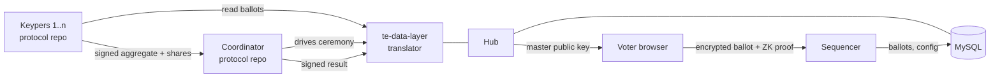

# Permanent private voting (`shutter-elgamal`)

> **Alpha.** The UI surfaces an "Alpha" tag on the **Permanent private voting** privacy option.

The entry point for Snapshot's **permanent private voting**: a proposal privacy mode,
`privacy: 'shutter-elgamal'`, in which every ballot is encrypted in the browser and **stays
encrypted forever**. Only the final tally is ever revealed, and the Snapshot backend cannot decrypt
an individual vote at any point — not during voting, not after, not with its database.

It is built on **linearly-homomorphic threshold ElGamal over BLS12-381**. Voters encrypt under a
committee master public key, the ciphertexts are summed homomorphically, and a committee of
independent **keypers** jointly decrypt only the sum.

**Snapshot does not run the committee.** The keypers are the [generalised-el-gamal][geg] protocol's
own service, each run by a separate operator holding a signing key this repository never sees; this
repository is the data layer they read ballots from and write results to. The coordinator *is* run
here — it relays their writes and publishes the result, but it holds no share and cannot decrypt.

[geg]: https://github.com/shutter-network/generalised-elgamal-voting

---

## Contents

- [How it works](#how-it-works)
- [Where the code lives](#where-the-code-lives)
- [Crypto parameters](#crypto-parameters)
- [Weight scaling](#weight-scaling--the-units-a-proposal-counts-in)
- [Coordinator sizing](#coordinator-sizing--what-a-tally-costs)
- [Running it](#running-it)
- [Lifecycle of a proposal](#lifecycle-of-a-proposal)
- [Security model](#security-model)
- [Operational rules worth knowing](#operational-rules-worth-knowing)
- [Troubleshooting](#troubleshooting)
- [Reference](#reference)

---

## How it works


```mermaid
flowchart LR
    A[Voter browser] -->|encrypted ballot + ZK proof| S[Sequencer]
    S -->|ballots, config| DB[(MySQL)]
    H[Hub] --- DB
    H -->|master public key| A
    L[te-data-layer<br/>translator] --- H
    C[Coordinator<br/>protocol repo] -->|drives ceremony| L
    K[Keypers 1..n<br/>protocol repo] -->|read ballots| L
    K -->|signed aggregate + shares| C
    C -->|signed result| L
```

1. **Key generation.** When a private proposal is created, the sequencer freezes the committee onto
   it and the coordinator drives a Feldman-VSS distributed key generation. The keypers publish a
   single master public key (`te_mpk`); no party ever holds the full secret. This must complete
   **before voting opens** — a key that arrives later cannot match the ballots, so the proposal is
   terminally dead rather than merely late.
2. **Voting.** The browser encrypts under `te_mpk`, attaches a zero-knowledge proof that the ballot
   is well-formed (per-candidate range plus an exact budget), signs it with the voter's wallet
   (EIP-712), and carries an eligibility credential minted by the sequencer at ingest, binding that ballot's voting
   power. The sequencer verifies every ballot at ingest.
3. **Aggregation.** After close, **every keyper independently re-derives** the voting-power-weighted
   sum from the same ordered ballots and submits it signed. The artifact becomes canonical only when
   a quorum submits it **byte-identically**.
4. **Decryption.** Each keyper publishes a partial decryption share with a DLEQ proof. The
   coordinator recovers the plaintext totals by Lagrange interpolation and baby-step-giant-step,
   signs them, and publishes. The hub verifies the signature; the sequencer mirrors the scores.

Step 3 is the one that changed, and it is the point of the whole design. The sequencer used to sum
the ballots alone, which meant isolating one voter's ballot required compromising one process.
Now it requires corrupting a majority of the committee.

A voter with voting power `N` is counted `N` times by scaling their ciphertexts by `w = round(vp)`
before the sum — no change to the ballot cryptography. Voting power below 0.5 would round to weight 0 
and contribute nothing, so such a vote is refused at ingest rather than accepted and dropped.

---

## Where the code lives

| Component | Path | Role |
| --- | --- | --- |
| Client crypto SDK | `@shutter-network/urban-verified-crypto` | Ballot construction, ZK proofs, verification, tally recovery. Published package, BLST WASM. |
| Hub | [apps/hub](../../apps/hub) | GraphQL/REST. Storage of record for ballots, DKG results, aggregates, shares, results. Verifies every protocol write. |
| Sequencer | [apps/sequencer](../../apps/sequencer) | Vote ingestion and ballot verification; freezes the committee onto each proposal; mirrors published totals into `scores`. |
| Translator | [apps/te-data-layer](../../apps/te-data-layer) | Presents the hub to the protocol as its data layer, over the port contract. |
| Voter UI | [apps/ui](../../apps/ui) | Builds encrypted ballots locally; the verify-tally panel; the stall notice and admin retry. |
| Committee | **not in this repo** | Keypers and coordinator live in the protocol repository, run by independent operators. |

---

## Crypto parameters

| Parameter | Value |
| --- | --- |
| Curve | BLS12-381 (ElGamal in G₂, Schnorr in G₁) |
| Threshold | `t = 2, n = 3` — `t` is the **quorum**, the number of keypers required |
| Ballot variant | Variant A, exact budget `B = 1` (single-choice) or `B = 100` (weighted) |
| DKG | Feldman verifiable secret sharing |
| Write authorisation | `GEG-DKG-RESULT-v1`, `GEG-AGGREGATE-v1`, `GEG-DECRYPT-SHARE-v1`, `GEG-RESULT-v1`, wrapped in `GEG-REQUEST-v1` |
| Digest parity | Vectors generated by the protocol's Python, in `apps/hub/test/fixtures/geg-*.json` |

### Weight scaling — the units a proposal counts in

A tally is recovered by searching a range of size `budget x Σ(weights)`, so an electorate
large enough to push that past the coordinator's capacity would be untallyable. Rather than
capping anyone, a private proposal declares a **scale**: every voter's power is divided by
the same power of two, and the tally is counted in those units.

```
scale  = smallest power of two s such that  budget x ceil(V / s) <= TE_SOLVER_CEILING
weight = (vp + s/2) // s          integer half-up, identical in the hub, the UI and the committee
```

`V` is an upper bound on the proposal's total voting power, resolved **once at creation** and
frozen into `te_geg_config` along with `scale`:

| Space's strategies | `V` |
| --- | --- |
| All recognised token strategies (`erc20-balance-of`, `erc20-votes`, `erc20-balance-of-delegation`, `erc721`, `erc721-enumerable`) | Sum of `totalSupply()` at the proposal's frozen snapshot block |
| Anything else (`ticket`, `whitelist`, quadratic, custom …) — even one | `floor(TE_SOLVER_CEILING / budget)` |

The fallback is not a guess at the space's voting power; no such number is knowable for a
`ticket` or `whitelist` space. It is the largest `V` that still leaves `scale = 1`, so a space
that cannot be measured keeps full precision. There is deliberately no override: a value above
it forces needless scaling, and one below it forces needless scaling *and* narrows the alarm
below. `TE_SOLVER_CEILING` is the only honest way to move it.

**`scale` is 1 for essentially every real space,** in which case none of this is visible. At the
default 1e12 ceiling and budget 100, scaling starts above 1e10 whole tokens of total supply.

**What a voter sees when `scale > 1`.** The proposal sidebar says *"Counted as N. This proposal
counts in units of S, so every voter's power is divided by the same amount."* Two holdings can
reach zero, and they are not the same thing:

- **Below 0.5 raw voting power** — refused at credential issuance; the voter cannot vote.
- **At least 1 raw, but below `scale/2`** — *admitted*. The credential is issued, the ballot is
  signed and recorded, and the committee aggregates it with weight zero. The UI warns before
  signing (*"Your vote would not move this tally"*); nothing downstream will. Refusing instead
  would disenfranchise a real holder over an operator's ceiling setting, and unlike true dust it
  is always recoverable by raising `TE_SOLVER_CEILING`.

**Why a divisor and not a cap.** This replaced a per-voter ceiling of `floor(1e6 / budget)` —
10,000 at budget 100 — which flattened the top of every cap table it touched: a holder of 25,000
and one of 25,000,000 voted identically. A divisor divides everyone, so every ratio survives and
the whole distribution is simply measured in coarser units. The cost moves from *some voters
losing most of their power* to *everyone losing at most half a unit*.

**Worked example.** A 1,011,123-supply token at budget 100, holders of 995,500 / 69 / 53 / 31:

| `TE_SOLVER_CEILING` | `scale` | Counted |
| --- | --- | --- |
| 1e12 (default) | 1 | 995,500 / 69 / 53 / 31 — all in full |
| 1e6 | 128 | 7,777 / 1 / 0 / 0 — the last two admitted but worth nothing |

**If `V` turns out too low**, the sequencer logs an alarm as attested weight passes it, naming
`TE_SOLVER_CEILING`. It is an alarm and not a refusal: the tally degrades to a slower one rather
than an impossible one, and blocking a voter over an operator's estimate would be worse.

---

### Coordinator sizing — what a tally costs

The committee never reveals a plaintext directly. It publishes a homomorphic aggregate and
threshold decryption shares; recovering the per-candidate totals means **searching for a discrete
logarithm** over the range `budget x Σ(admitted weights)`, by baby-step giant-step. That search is
the coordinator's whole job at tally time, and it is the only part of the system whose cost depends
on how much voting power turned out.

**Measured cost model.** With `m = √(budget x Σw)`:

```
tally time    ≈ 2m x 11 µs      (m operations to build the table, plus ~m giant steps in total)
table memory  ≈ 218 B x m
```

Both constants measured against `py_arkworks_bls12381`, the coordinator's curve backend:

- **11 µs per inner-loop operation** (G₂ add + compress + hash-map op), stable from `m = 3e5` to
  `m = 5e6` — no cache cliff. The model predicts measured runs within 5%: bound 1e12 → 22 s
  predicted / 22.9 s measured; 9e12 → 66 s / 69.4 s; 2.5e13 → 110 s / 107.9 s.
- **218 bytes per table entry**, exactly linear at 500k and 2M entries: 144 B for the 96-byte
  compressed point (pymalloc-rounded), 32 B for the integer value (`j > 256`, so outside CPython's
  small-int cache), 42 B of hash-map slot.

The giant-step total is `≈ m` **across all candidates, not per candidate**: in `mode: exact` the
per-candidate totals sum to `budget x Σw = m²`, so the walks share one budget. **Candidate count
does not change tally cost.**

**Machine table.** Sized at ~300 B per entry of machine RAM — the 218 B table plus the hash-map
resize transient, interpreter, ballots and aggregate.

| Coordinator RAM | `m` | Search bound `budget x Σw` = **`TE_SOLVER_CEILING`** | Max Σ voting power at `scale = 1`, budget 1 | Max Σ voting power at `scale = 1`, budget 100 | Tally wall-clock |
| --- | --- | --- | --- | --- | --- |
| 1 GB | 3.6e6 | 1.3e13 | 1.3e13 | 1.3e11 | 1.3 min |
| **2 GB** | 7.2e6 | **5.1e13** | **5.1e13** | **5.1e11** | **2.6 min** |
| 4 GB | 1.4e7 | 2.0e14 | 2.0e14 | 2.0e12 | 5.3 min |
| 8 GB | 2.9e7 | 8.2e14 | 8.2e14 | 8.2e12 | 11 min |
| 16 GB | 5.7e7 | 3.3e15 | 3.3e15 | 3.3e13 | 21 min |
| 32 GB | 1.1e8 | 1.3e16 | 1.3e16 | 1.3e14 | 42 min |
| 64 GB | 2.3e8 | 5.2e16 | 5.2e16 | 5.2e14 | 84 min |

**Reading this table as an operator.** Pick the row matching the RAM you will give the
coordinator, and set `TE_SOLVER_CEILING` to that row's **search bound**. That single value is the
promise the deployment makes about its own capacity — every proposal derives its `scale` from it,
so understating it scales proposals that did not need it, and overstating it sizes a tally the
machine cannot finish.

**The shipped default is deliberately below the smallest row.** `TE_SOLVER_CEILING` defaults to
`1e12` — `m = 1e6`, a ~218 MB table, ~22 s tally — which is roughly a 0.5 GB coordinator, ~50x
under the recommended 2 GB row. It errs toward a machine that certainly exists rather than one the
operator was assumed to have, so **raise it to match your actual coordinator**. Left at the
default, spaces above 1e10 whole tokens of supply scale when a 2 GB box would not have needed to.

"Σ voting power" is the sum of whole-unit voting power over ballots that were actually cast, not
total supply. Cost scales as `√`, so **4x the RAM buys 16x the voting power**.

The two voting-power columns are the maxima **at `scale = 1`** — the point past which scaling
starts, not a hard limit. A space above the line still tallies; its proposals simply count in
units of 2, 4, 8 … (see [Weight scaling](#weight-scaling--the-units-a-proposal-counts-in)). So
these columns say "how much voting power fits at full precision", and the search-bound column
says "what this machine can actually solve".

**Two things to know before reading a row off this table.**

1. **Measure on Linux, not macOS.** macOS compresses memory, so `ps` RSS reads roughly half the true
   footprint (87 B/entry observed at `m = 3e6` against 218 B/entry accounted). The coordinator runs
   Linux in Docker, where that does not apply. Size against the accounted figure.
2. **One table serves the whole election.** `recover_result` builds the baby-step table once via
   `build_baby_step_table(bound)` and reuses it across candidates. An earlier build called
   `baby_step_giant_step` inside the candidate loop, rebuilding the table every time, which cost
   about `(ℓ+1)/2` times the table — roughly 3x for a 5-choice proposal. The figures above are the
   single-table cost and are what the current code does.

**Recommendation: 2 GB covers essentially every DAO.** At budget 100 it allows 5.1e11 of turned-out
voting power — a token with 1e9 total supply is 500x under the line at *100%* turnout. Reach for
8-16 GB only for extreme-supply tokens (meme-coins in the 1e14-1e15 range) at realistic turnout.

**This is not the constraint that limits proposal size.** Every keyper verifies every ballot at
admission, at roughly 2.7 ms per proof branch and `choices x (budget + 1)` branches per ballot. For a
5-choice weighted proposal that is 1.30 s per ballot — so 1,000 ballots is **22 minutes of admission
against 23 seconds of tally**. Ballot count, choices and budget bound an election long before voting
power does.

## Running it

See **[`DEPLOYMENT_SETUP.md`](./DEPLOYMENT_SETUP.md)** beside this file — a copy-paste walkthrough
run entirely from this repository: the environment, the stack, creating a proposal, voting, and
watching the tally publish. Its §1b links the two files you need if you also want to run a keyper
yourself; everything else is here.

The three "Running it" sections that used to be here described a compose file that started the
committee alongside Snapshot's services. That arrangement gave one `docker compose up` the power to
read every ballot, and it no longer exists.

---

## Lifecycle of a proposal

| Stage | What must be true |
| --- | --- |
| Creation | Opens at least `MIN_DKG_LEAD_TIME_S` (180s) ahead; every keyper reachable, since the sequencer resolves the committee from each `/status` |
| DKG | Needs **every** member, not a quorum. Failure is terminal at `voting_start` |
| Voting | `te_mpk` present; each ballot verified at ingest and carrying an eligibility credential |
| Aggregation | Past `votingEnd`; a quorum of byte-identical artifacts makes one canonical |
| Decryption | A canonical aggregate exists; shares are DLEQ-verified against it |
| Result | Signed by the coordinator, verified against the frozen `resultPublisherAddress` |
| Mirror | The sequencer divides by the budget and writes `scores`, `scores_state = 'final'` |

Two states are worth naming because they are visible to users:

- **Stalled** — the committee could not finish. Persisted, so a coordinator restart does not resume
  it; an admin clears it from the proposal page. The two directions are signed by different
  identities on purpose.
- **DKG failed** — voting opened with no key. Terminal, and **derived on read** rather than stored:
  `privacy ∧ ¬te_mpk ∧ now > start`.

---

## Security model

Threshold `t = 2, n = 3`: two keypers must cooperate to open a tally; one alone learns nothing.

| Adversary | Outcome |
| --- | --- |
| Network observer (passive) | Freshly-randomised ciphertexts and public signatures. The candidate vector is information-theoretically masked. No exposure beyond Snapshot's existing voter↔proposal links. |
| Single malicious keyper | Holds 1 of 3 shares — learns nothing. Malformed shares are caught by the DLEQ proof, re-run by the "Verify tally" button. |
| Two colluding keypers | Can decrypt the per-candidate **aggregate** only. Individual ballots are never decrypted by anyone. |
| Malicious hub or sequencer | Cannot forge ballots (Schnorr + EIP-712), cannot decrypt, and **cannot produce the canonical aggregate** — it only records what keypers submit and promotes what a quorum agrees on. Hiding a ballot now requires corrupting a majority of the committee. |
| Ballot stuffing | The budget proof requires the ciphertext sum to encrypt exactly `B`. Over-budget ballots fail verification at ingest. |
| Replay across proposals | Each ballot binds the proposal id into `electionId` and `pseudonym = keccak256(voter ‖ proposalId)`. |
| Deleting an inconvenient tally | **Not prevented.** A private proposal is deletable on the same terms as a public one, at any point, by its author, an admin, or a moderator. Unlike a public tally it is not reconstructible afterwards — accepted deliberately. |
| Long-term key compromise | Forward secrecy is per-proposal; each proposal runs a fresh DKG. |

**Operational trust vs protocol trust — the hub.** This deployment runs the hub, and treats it as
trusted in day-to-day operation. That is a *deployment* position, and it is what justifies recording
purely diagnostic fields unsigned — the coordinator's stall reason, for instance, is stored and shown
verbatim with no signature over it.

It is deliberately **not** a protocol assumption, and the row above stays true: nothing in a tally's
integrity rests on the hub behaving. The aggregate is canonical only when a keyper quorum submits it
byte-identically, every decryption share carries a DLEQ proof, and the "Verify tally" button
recomputes the aggregate from the raw ballots and checks the published totals against the shares
itself. All of that holds if the hub misbehaves, and it is why those checks exist rather than being
skipped for a service we operate.

The rule that keeps the two apart: **unsigned hub-supplied data may direct a human's attention; it
must never gate an automated action or stand in for a cryptographic check.** A stall reason that only
tells an operator where to look is fine unsigned. The same string driving an auto-retry, an
auto-resume, or coordinator autoscaling would have to move inside the signed `tally_stall` digest
first — unauthenticated input driving automation is a different risk class.

**Out of scope:** DoS and availability, host side-channels, coercion resistance, and quantum
adversaries (BLS12-381 confidentiality is post-quantum-vulnerable, as with every BLS12-381 system).

**Known limitation — committee discovery.** `TE_KEYPERS` holds URLs; each address is read from that
keyper's `/status` once per sequencer process and frozen into the proposal. Over HTTPS the
certificate anchors that identity; over plain HTTP the network path does. Use HTTPS keyper URLs in any real deployment.

**Operator policy:** three keypers run by three independent organisations, each holding its own
signing key and its own encrypted state directory. A keyper that produces a verification failure
during an audit is removed from the committee before the next proposal.

---

## Operational rules worth knowing

Each of these has produced a confusing failure at least once:

- **A keyper must be reachable when a private proposal is created**, because the committee is
  resolved then. It fails loudly at creation rather than producing a proposal that dies later.
- **Two keyper URLs must not report the same address.** A committee of "3" that is really 2 keys
  makes `t = 2` satisfiable by one operator. Refused at creation.
- **`GEG_API_URL` on a keyper is a base URL** — it appends `/port` itself. Including the suffix
  yields `/port/port` and every read 404s.
- **Losing a keyper's state directory loses its share.** If that puts the committee below quorum,
  those elections can never be decrypted, by anyone.
- **A private proposal can be deleted at any point**, like a public one, and its
  committee artifacts go with it. Unlike a public tally, nothing can reconstruct it
  afterwards.
- **Editing is allowed until `start`**, including inside the DKG lead-time window once the key
  exists.
- **Private voting closes one second before public voting.** The protocol's window is
  half-open (`start <= t < end`) where Snapshot's is closed, and the committee re-checks the
  window at tally time. A vote timestamped exactly at `end` would be accepted by Snapshot,
  excluded by the committee, and — because the verify panel recomputes over every published
  ballot — would report the whole tally as unverified. Private proposals therefore use the
  protocol's boundary.
- **Voting power below 0.5 cannot vote on a private proposal.** It would round to zero weight
  and contribute nothing, so the credential is refused at issuance with a message saying so.
  Refused rather than accepted-and-dropped because a zero-weight ballot never enters the
  keypers' feed at all — it would appear in neither the admitted set nor the exclusion list,
  leaving a voter who believes they voted with no way to discover otherwise. The same holding
  votes normally on a public proposal. Distinct from a holding that rounds to zero because of
  `scale`: that one *is* admitted and recorded, and only the UI warns about it.
- **`t = 2, n = 3` and "2-of-3" mean the same thing** — two keypers must cooperate. Older notes
  in this directory say `t = 1, n = 3` for the same committee, counting tolerated faults instead
  of the required quorum. Mixing the two is what produces a config rejected as
  *"threshold must be a majority"*.

---

## Troubleshooting

- **"proposal does not yet have a finalised threshold key"** → the DKG has not completed. If
  `start` has already passed it never will; the proposal is terminally dead and the UI shows a DKG
  failure notice.
- **Proposal stuck on "Finalizing results"** → the scores endpoint was never called or could not be
  reached. `curl -sL localhost:3000/api/scores/<id>` should return `{"result":true}`; if the redirect
  target is not resolvable from a browser, fix `SEQUENCER_PUBLIC_URL`.
- **`TE_KEYPERS entry "…" looks like "address@url"`** → the config takes URLs only now; addresses are
  read from `/status`.
- **Tally stalled** → the notice names three possible causes and asserts none, because the stored
  flag is a boolean. Which one it was is in the coordinator's log: `grep abandoned`.
- **Committee writes rejected as `not_a_registered_keyper`** → the address recovered from the
  signature is not in the proposal's frozen config. Usually a keyper key rotated after the proposal
  was created; the frozen config is deliberately immutable.

